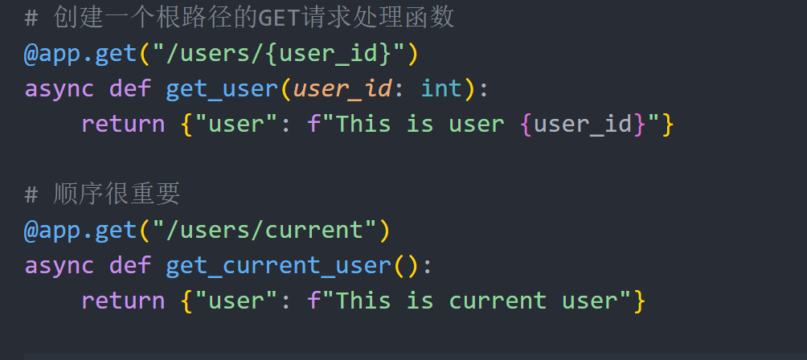
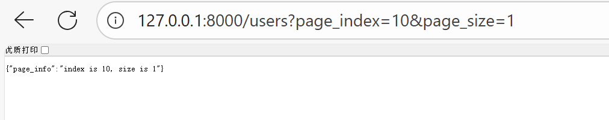
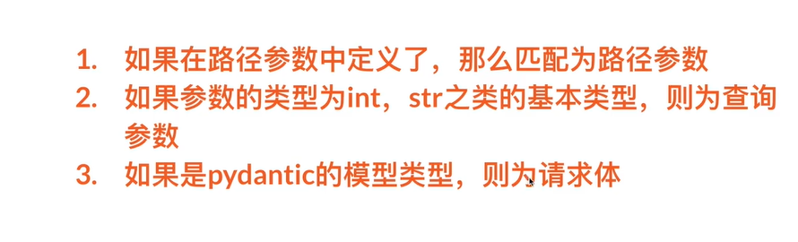
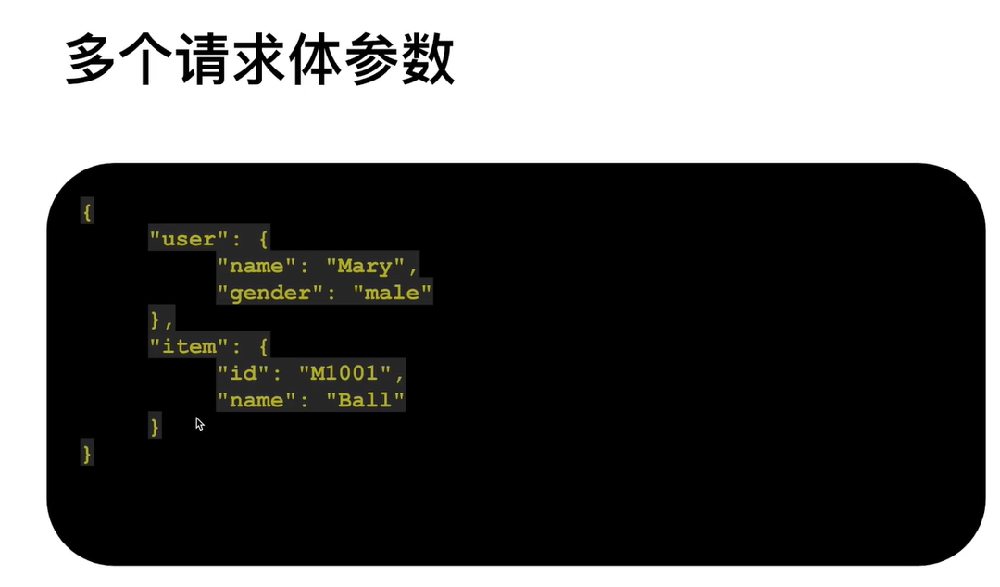
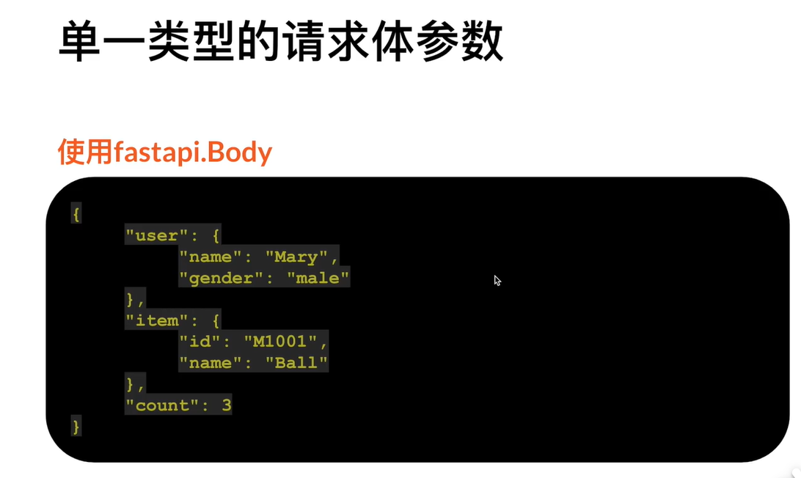
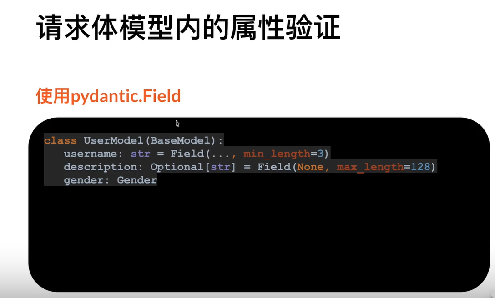
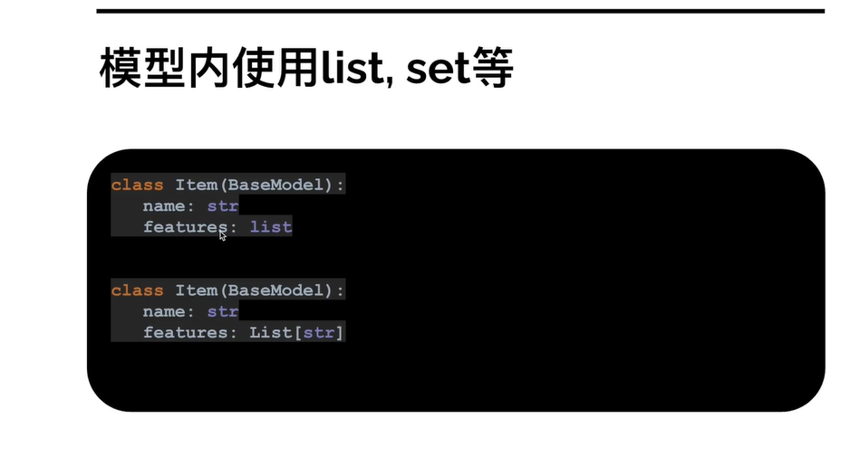

# FastAPI_study_0_to_1
参考B站UP主[跟着峰哥学编程](https://space.bilibili.com/3461574561892826) 的[FastAPI教学视频](https://space.bilibili.com/3461574561892826/lists/2056242?type=season)

## Day 01 第一个Restful API
### 输出hello world
```python
# 导入fastapi
from fastapi import FastAPI
import uvicorn

# 创建FastAPI的实例
app = FastAPI()

# 创建一个根路径的GET请求处理函数
@app.get("/helloworld")
async def hello_world():
    return {"message": "Hello, World!"}


# 运行的两种方式
# # 1. 在终端中运行以下命令
# cmd终端先进入对应的文件夹再运行命令, 注意app前面是py文件名
# uvicorn 01_Hello_FastAPI:app --reload

# # 2. 在代码中添加以下代码
if __name__ == "__main__":
    uvicorn.run("01_Hello_FastAPI:app", reload=True)
```

### 运行的两种方式
1. 在终端中运行以下命令
   cmd终端先进入对应的文件夹再运行命令, 注意app前面是py文件名
   ```bash
   uvicorn 01_Hello_FastAPI:app --reload
   ```
2. 在代码中添加以下代码
   ```python
   if __name__ == "__main__":
       uvicorn.run("01_Hello_FastAPI:app", reload=True)
   ```  

### 查看现有的请求函数的参数与响应
运行后在浏览器中访问 http://127.0.0.1:8000/docs


## Day 02 路径参数和查询参数

### 路径参数
在路径中定义参数，参数会作为函数的参数传入
函数的顺序很重要，小范围在前，大范围在后，默认使用第一个，限制user_id为int类型


对于枚举类型的路径参数，通过创建枚举类实现
```python
# 定义一个枚举类
from enum import Enum
class Gender(str, Enum):
    male = 'male'
    female = 'female'

@app.get("/students/{gender}")
async def get_user(gender: Gender):
    return {"student": f"This is a {gender.value} student"}
```

### 查询参数
查询参数是URL中`?`后面的参数，可以有多个，多个参数之间用`&`连接
把查询参数放在请求函数的参数中即可，FastAPI会自动识别
没有在路径参数里面定义都是查询参数


代码示例
```python
@app.get("/users")
async def get_users(page_index: int , page_size: int ):
    # page_index: 页码
    # page_size: 每页显示的条数
    return {"page_info": f"index is {page_index}, size is {page_size}"}
```

### 可选查询参数
通过`typing`模块的`Optional`类型实现可选查询参数默认值；

```python
from typing import Optional
@app.get("/users")
async def get_users(page_index: int , page_size: Optional[int] = 30):
    # page_index: 页码
    # page_size: 每页显示的条数，默认值为30
    return {"page_info": f"index is {page_index}, size is {page_size}"}
```

## Day 03 请求体和参数验证
### 请求体
请求体是POST请求中携带的数据，可以是JSON、表单等格式
通过`pydantic`模块定义数据模型，实现请求体的参数验证
```python
from pydantic import BaseModel  
class User(BaseModel):
    username: str
    password: str
    age: Optional[int] = None

@app.post("/users")
async def create_user(user: User):
    return {"user_info": user}
```
#### 函数的参数识别规则


#### 常见请求类型
| 方法       | 用途                     | 幂等性 | 安全性 | 请求体支持 | 典型状态码               | 示例场景                          | 
|------------|--------------------------|--------|--------|------------|--------------------------|-----------------------------------|
| **GET**    | 获取资源（读取操作）     | ✅ 是   | ✅ 安全 | ❌ 无       | 200 OK, 404 Not Found    | 访问网页、查询数据（如 `/api/users`） | 
| **POST**   | 创建资源或提交数据       | ❌ 否   | ❌ 不安全 | ✅ 有      | 201 Created, 400 Bad Request | 用户注册、上传文件（如 `/api/users`） |
| **PUT**    | 更新资源（整体替换）     | ✅ 是   | ❌ 不安全 | ✅ 有      | 200 OK, 204 No Content   | 修改用户资料（如 `/api/users/123`） |
| **DELETE** | 删除资源                 | ✅ 是   | ❌ 不安全 | ❌ 无（可选） | 204 No Content, 404 Not Found | 删除订单（如 `/api/orders/456`） | 
| **PATCH**  | 部分更新资源             | ❌ 否*  | ❌ 不安全 | ✅ 有      | 200 OK, 400 Bad Request  | 修改用户邮箱（如 `/api/users/123`） | 
| **HEAD**   | 获取资源元信息（无响应体）| ✅ 是   | ✅ 安全 | ❌ 无       | 200 OK, 404 Not Found    | 检查文件大小或缓存有效性          | 
| **OPTIONS**| 查询服务器支持的方法     | ✅ 是   | ✅ 安全 | ❌ 无       | 200 OK, 405 Method Not Allowed | CORS预检请求（如跨域检查）       | 
| **TRACE**  | 回显请求路径（调试用）   | ✅ 是   | ✅ 安全 | ❌ 无       | 200 OK                   | 测试代理服务器是否篡改请求        | [1][5][7]       |
| **CONNECT**| 建立隧道（如HTTPS代理）  | ❌ 否   | ❌ 不安全 | ❌ 无       | 200 Connection Established | 通过代理建立加密连接              | 

**关键说明**：  
1. **幂等性**：GET、PUT、DELETE等方法多次执行结果一致，而POST和PATCH可能产生多次副作用。  
2. **安全性**：仅GET、HEAD等不修改资源的方法被视为安全方法。  
3. **请求体**：POST、PUT、PATCH需通过请求体传输数据，GET参数通过URL传递。  
4. **状态码**：成功操作通常返回2xx，客户端错误返回4xx（如404资源不存在）。  
5. **扩展方法**：如WebDAV的MOVE/COPY等需服务器支持。

### 参数验证
参数验证的工具类
- 路径参数：fastapi.Path
- 查询参数：fastapi.Query
  
```python
# 对路径参数进行验证
# 验证最大最小值 
@app.get("/users/{user_id}")
async def get_user(user_id: int = Path(..., title='user ID', ge = 0, le = 1000)):
    return {"user": f"This is user {user_id}"}

# 也可以使用正则表达式进行参数验证
@app.get("/items/{item_no}")
async def get_item(item_no: str = Path(..., title='Item No', regex='^[a|b|c]-[\\d]*$')):
    return {"item": f"This is a book for {item_no}"}

# 对查询参数进行验证
@app.get("/users")
async def get_users(page_index: int = Query(1, title='Page Index', ge = 1, le = 1000)):
    return {"user": f"Index: {page_index}"} 
```

### 多个请求体参数验证


### 单一请求体参数验证


```python

class User(BaseModel):
    username: str
    description: Optional[str] = 'default'

class Item(BaseModel):
    name: str
    length: int


@app.put("/carts/{cart_id}")
async def update_cart(cart_id: int, user: User, item: Item, count: int = Body(..., ge = 1)): 
    print(user.username)
    print(item.name)
    result_dict = {
        'cart_id': cart_id,
        'username': user.username,
        'itemname': item.name,
        'count': count
    }
    
    return result_dict
                
if __name__ == "__main__":
    uvicorn.run("06_深入请求体:app", reload=True)
```

### 请求体模型内的属性验证


```python
class User(BaseModel):
    username: str = Field(..., min_length= 3)
    description: Optional[str] = 'default'
```

### 请求体模型内的模型验证
```python
class Address(BaseModel):
    address: str
    postcode: str


class User(BaseModel):
    username: str = Field(..., min_length= 3)
    description: Optional[str] = 'default'
    address: Address
```

### 模型内使用list,set,dict等类型

