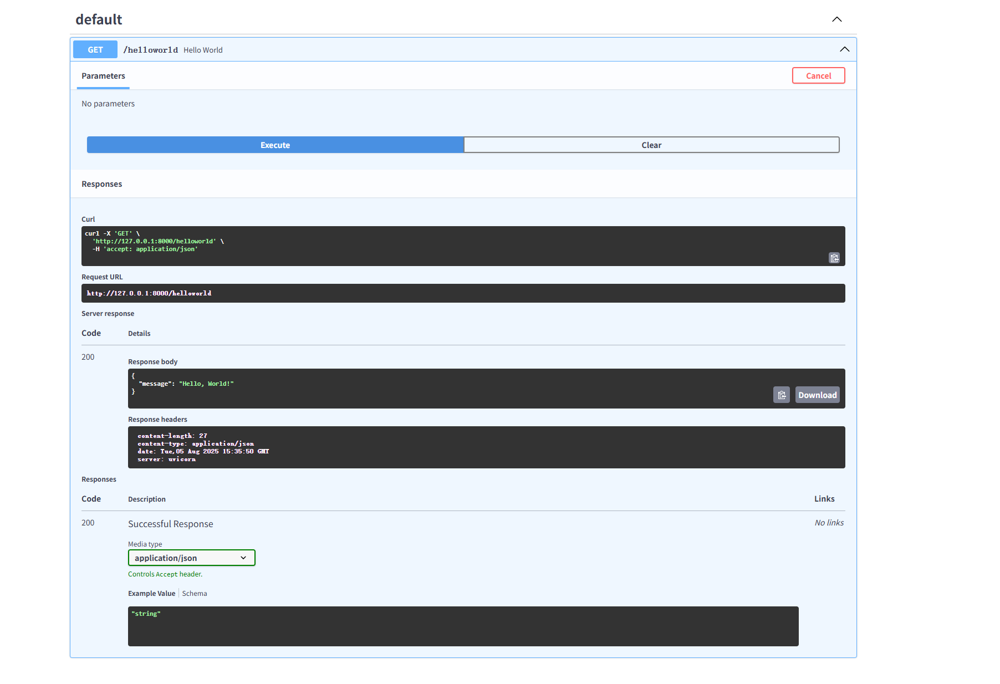

# FastAPI_study_0_to_1
参考B站UP主[跟着峰哥学编程](https://space.bilibili.com/3461574561892826) 的[FastAPI教学视频](https://space.bilibili.com/3461574561892826/lists/2056242?type=season)

## Day 01 第一个Restful API
### 输出hello world
```python
# 导入fastapi
from fastapi import FastAPI
import uvicorn

# 创建FastAPI的实例
app = FastAPI()

# 创建一个根路径的GET请求处理函数
@app.get("/helloworld")
async def hello_world():
    return {"message": "Hello, World!"}


# 运行的两种方式
# # 1. 在终端中运行以下命令
# cmd终端先进入对应的文件夹再运行命令, 注意app前面是py文件名
# uvicorn 01_Hello_FastAPI:app --reload

# # 2. 在代码中添加以下代码
if __name__ == "__main__":
    uvicorn.run("01_Hello_FastAPI:app", reload=True)
```

### 运行的两种方式
1. 在终端中运行以下命令
   cmd终端先进入对应的文件夹再运行命令, 注意app前面是py文件名
   ```bash
   uvicorn 01_Hello_FastAPI:app --reload
   ```
2. 在代码中添加以下代码
   ```python
   if __name__ == "__main__":
       uvicorn.run("01_Hello_FastAPI:app", reload=True)
   ```  

### 查看现有的请求函数的参数与响应
运行后在浏览器中访问 http://127.0.0.1:8000/docs
